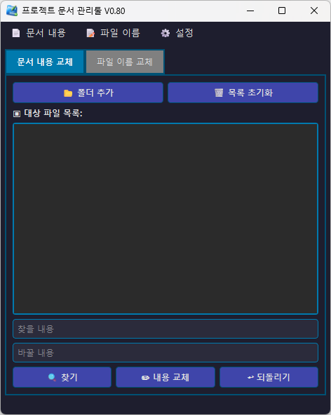
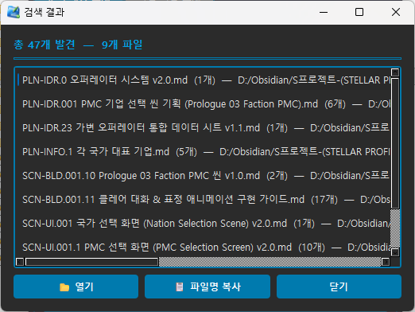
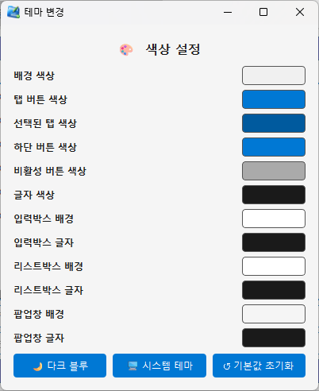
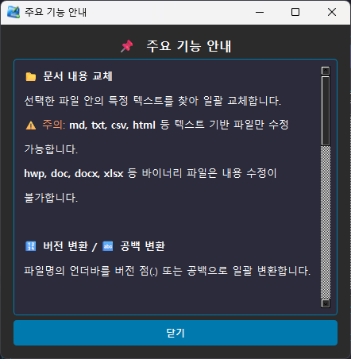

# 📄 프로젝트 문서 관리툴

> 파일 내용 교체 · 파일명 일괄 변환 · 편집기 연동을 지원하는 Windows용 문서 관리 유틸리티




## 📌 주요 기능

### 📂 문서 내용 교체
- 여러 파일 안의 특정 텍스트를 한 번에 찾아 **일괄 교체**
- 텍스트 기반 파일(md, txt, csv, html 등) 지원
- **찾기** 기능을 통해 검색 결과 리스트 확인 후 파일 바로 열기 / 경로 복사 가능

### 📝 파일 이름 교체
- 파일명 내 특정 문자열 일괄 교체
- 버전 변환 (`v1_2` → `v1.2`)
- 공백 변환 (`_` → 공백)
- 묶인 구간 삭제 (예: `(임시)` → 제거)
- 숫자만 남기기 / 숫자 모두 삭제
- 자리수 맞추기 (예: `3` → `003`)
- 일련번호 붙이기 (앞/뒤/폴더별)

### ↩ 되돌리기
- 마지막 작업(내용 교체 또는 이름 교체)을 이전 상태로 즉시 복구

### 🎨 테마 커스터마이징
- 색상 항목별 개별 설정
- 다크 블루 / 시스템 테마 / 기본값 초기화



### ✏ 편집기 등록
- 검색 결과에서 파일을 원하는 편집기로 바로 열기
- 미등록 시 메모장(기본값)으로 실행



---

## ⌨ 단축키

| 단축키       | 기능                          |
|-------------|-------------------------------|
| `Ctrl + Z`  | 되돌리기 (현재 탭 기준)        |
| `Ctrl + F`  | 찾기 (문서 내용 탭)            |
| `Ctrl + R`  | 교체 실행 (현재 탭 기준)       |
| `Ctrl + D`  | 목록 초기화                   |
| `Ctrl + A`  | 목록 전체 선택                |
| `Delete`    | 선택 항목 삭제                |

---

## 🚀 실행 방법

### 소스로 실행
```bash
pip install PyQt6
python SentenceReplacer.py
```
실행파일로 빌드 (PyInstaller)

```bash
pip install pyinstaller
pyinstaller SentenceReplacer.spec
```

📁 파일 구성

```text
📁 프로젝트
├── SentenceReplacer.py     # 메인 소스코드
├── SentenceReplacer.spec   # PyInstaller 빌드 스펙 (선택)
├── CHANGELOG.md            # 전체 업데이트 이력
├── config.json             # 설정 파일 (테마, 편집기 경로 등)
├── icon.ico                # 프로그램 아이콘
└── README.md
```

---

📊 업데이트 내역

| 버전 | 날짜 | 주요 내용 |
| :--- | :--- | :--- |
| **V0.84** | 2026-04-11 | 문서 내용 찾기 버그 수정, 파일 이름 교체 버그 수정, 되돌리기 안정화 |
| **V0.83** | 2026-04-10 | 파일 목록 표시 최적화 (파일명만 표시 + 툴팁), 우클릭 메뉴 강화 |
| **V0.82** | 2026-04-10 | 비동기 폴더 스캔, 검색 결과 창 개선, 편집기 등록 기능 추가 |
| **V0.80** | 2026-04-10 | 검색 결과 리스트 UI, 파일 열기/경로 복사 기능 추가 |

*전체 변경 이력은 CHANGELOG.md 를 참고하세요.*

---

👤 만든이
재와니

블로그: blog.naver.com/akrsodhk